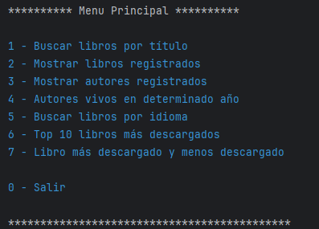

    
    

        LiteraturAPP
    

## Funcionalidades

1. **Buscar libro por título**: Permite buscar un libro por su título desde la API e insertar la información en la base de datos.
2. **Mostrar libros registrados**: Muestra todos los libros que han sido registrados en la base de datos.
3. **Mostrar  autores registrados**: Muestra todos los autores que han sido registrados en la base de datos.
4. **Mostrarautores vivos en un determinado año**: Permite listar los autores que estaban vivos en un año específico.
5. **Buscar libros por idioma**: Permite listar los libros por su idioma (ES, EN, FR, PT).
6. **Top 10 libros más descargados**: Muestra los 10 libros más descargados.
7. **Libro más descargado y menos descargado**: Muestra el libro más descargado y el menos descargado.

## Requisitos

- Java 17
- Spring Boot 3.2.4
- PostgreSQL
- Maven
